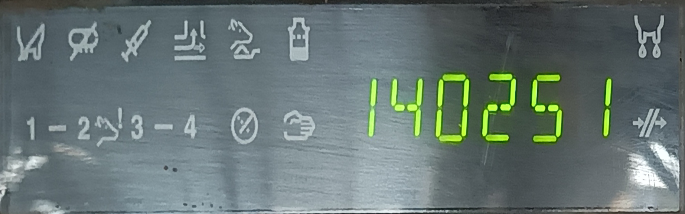

# 识别数字显示屏上的数字

要求在100ms内能够用在低成本的硬件上完成对数显屏的数字识别，并将识别到数字序列通过串口(232)或网口发送出去。为了让算法计算的更快，采用了固定摄像头+预先配置数显屏在图像中位置的方式。这样就可以根据预先配置的位置信息将数显区域直接裁减出来，只对数显区域做二值化、分割、识别等，从而让数字识别算法可以设计的更简单而且也达到了提高运行的速度的要求。为了降低硬件的成本，采用ARM的开发版(安卓机顶盒)+外接USB摄像头的方案。我在用的一款安卓机顶盒型号 X96 Air 淘宝售价在150元左右，和它同系列的 X96 mini 售价在90元左右。外接的USB口摄像头的720P的约70-120元，1080P的约120-180元。再加上一些额外的通信线材、架设支架之类的，整体的硬件成本在200-400元范围内。

## 1.USB摄像头
摄像头选择支持UVC协议的USB口外接摄像头，这样方便在不同的平台上使用。
在安卓设备上对USB摄像头的开发库参考了[node-v4l2camera](https://github.com/bellbind/node-v4l2camera/)，参考的代码在本工程 [**UVC**](./UVC) 目录下。由于USB摄像头传出来的图像编码有MJPG和YUYV，目前只测试使用了MJPG的。为了加速对MJPG数据流的解码参考了[嵌入式开发之Opencv(二)JPEG解码加速](https://blog.csdn.net/sanallen/article/details/80513031?spm=1001.2014.3001.5502)，更改了OpenCV里面的解码设置，可以降低一半的解码时间，在A55平台上测试解码720P在40ms左右，解码1080P在80ms左右。

## 2.数字识别
数字识别的代码在本工程[**OCR**](./OCR)目录下，识别的主要流程是：
* 根据配置好的屏幕区域(配置工具的代码在[**ROI**](./ROI)目录下，功能是从左上角按照逆时针方向点选屏幕的4个角并保存成yaml格式的文件)，通过投影变换得到方正的屏幕区域。
* 根据颜色将图像二值化(由于数字是绿色的，直接提取到G分量二值化)，更具数字大小和位置对区域进行筛选。
* 筛选后的区域，用[穿线法](https://blog.csdn.NET/sandalphon4869/article/details/94760482)识别具体的数值。

## 3.网络通信
所选的计算设备不支持串口通信，只能进行网络通信，代码在本工程[**net**](./NET)目录下，主要参考了[C++写Socket](https://www.cnblogs.com/yejianying/p/cpp_socket_0.html)中的代码，将其中的TCP改成了UDP。
